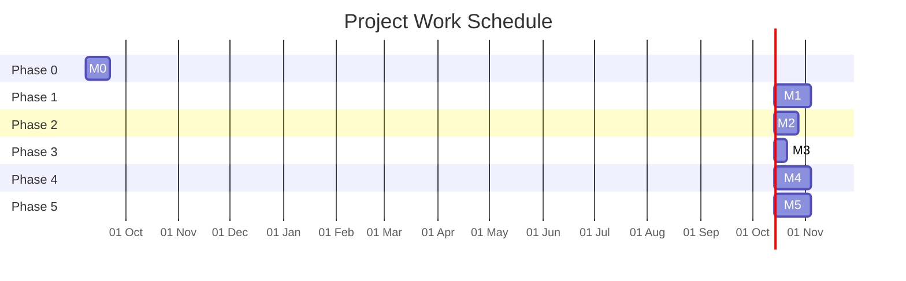
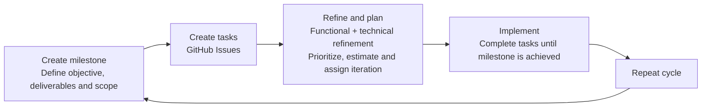

# Methodology and Planning

## Methodology and Success Metrics (OKRs / KPIs)

To ensure the success of the project and the effective execution of the strategies defined in the SWOT analysis, the following Objectives and Key Results (OKRs) have been established. These objective metrics allow the evaluation of progress and the achievement of quality, planning, and technical value goals.

  <section class="okr-card">
    <h3>OKR 0: Client Value and Usability</h3>
    
<strong>Objective:</strong> Deliver a tool that is genuinely useful and adopted by the client.

    <ul>
      <li><strong>KR1:</strong> The client can perform all CRUD operations on Authors, Collections, and Books without requiring technical assistance or consulting documentation. <strong>KPI:</strong> Qualitative client feedback.</li>
      <li><strong>KR2:</strong> UI/UX designed to minimize clicks and confusing actions. <strong>KPI:</strong> Number of screens required to complete a key action ≤ 3.</li>
    </ul>
  </section>

  <section class="okr-card">
    <h3>OKR 1: Technical Quality and Robustness</h3>
    
<strong>Objective:</strong> Develop production-ready, clean, and maintainable code.

    <ul>
      <li><strong>KR1:</strong> Achieve and maintain 80% unit and integration test coverage across all critical repositories (backend and frontend). <strong>KPI:</strong> Code coverage percentage reported by Gradle.</li>
      <li><strong>KR2:</strong> Implement a minimum of two automated GitHub Actions workflows in each repository. <strong>KPI:</strong> Number of active GitHub Actions workflows passing successfully.</li>
    </ul>
  </section>

  <section class="okr-card">
    <h3>OKR 2: Efficient Planning and Execution</h3>
    
<strong>Objective:</strong> Manage the project using agile methodologies, compensating for limited resources.

    <ul>
      <li><strong>KR1:</strong> Refine 100% of tasks before moving them to <em>In Progress</em> on the Kanban board. <strong>KPI:</strong> Percentage of issues with a clear description and acceptance criteria.</li>
      <li><strong>KR2:</strong> Complete 100% of tasks defined within each milestone. <strong>KPI:</strong> Milestone completion rate.</li>
    </ul>
  </section>

  <section class="okr-card">
    <h3>OKR 3: Value as a Technical Portfolio</h3>
    
<strong>Objective:</strong> Turn the project into a tangible demonstration of technical competencies.

    <ul>
      <li><strong>KR1:</strong> Ensure that 100% of repositories include a professional README with badges, project description, tech stack, and deployment guide. <strong>KPI:</strong> README elements checklist completion.</li>
      <li><strong>KR2:</strong> Deploy and keep the production environment active. <strong>KPI:</strong> Health check endpoint returns HTTP 200 OK.</li>
    </ul>
  </section>

  <section class="okr-card">
    <h3>OKR 4: Maintainability and Future Readiness</h3>
    
<strong>Objective:</strong> Ensure that the project remains relevant and easy to improve in the long term.

    <ul>
      <li><strong>KR1:</strong> Define the complete API contract in the <code>api-spec</code> repository before implementing any backend endpoints. <strong>KPI:</strong> Controller interfaces are auto-generated from the API specification.</li>
      <li><strong>KR2:</strong> Achieve a pure domain layer, 100% independent of frameworks and infrastructure libraries. <strong>KPI:</strong> Zero external framework imports in the domain module files.</li>
    </ul>
  </section>

## Timeline Planning / Work Schedule

Project planning has been structured around major milestones representing the achievement of significant functional objectives. These milestones will be recorded as GitHub Milestones and broken down into smaller tasks, known as issues in GitHub.

Each task will be associated with one or more Git branches, which will be merged into the main branch through Pull Requests. All project activity will be accessible and traceable through a Kanban board in GitHub Projects.

This phased approach is intended to apply best practices from Agile methodologies commonly used in industry, while also ensuring continuous value delivery through iterative and incremental functional releases.

### Milestones Table

| Phase | Milestone | Description | Delivery (Estimate) | Main Deliverables |
| --- | --- | --- | --- | --- |
| Phase 0 | **M0: Setup and Definition** | Initial GitHub Projects setup and complete definition of the API contract | September 22 (2 weeks) | `api-spec` repository; complete and stable OpenAPI specification; generated library |
| Phase 1 | **M1: Backend MVP (Authors)** | Basic Author CRUD use cases with full security | October 13 (3 weeks) | Functional Authors RESTful API; authentication and role-based authorization; tests and initial CI/CD |
| Phase 2 | **M2: Frontend MVP (Authors)** | UI development for author management and API integration | October 27 (2 weeks) | Android app with Authors CRUD; functional login; token management |
| Phase 3 | **M3: DevOps & Deployment** | Deployment automation through CI/CD | November 3 (1 week) | Deployed environment; CI/CD improvements; Dockerization improvements |
| Phase 4 | **M4: Full Functionality** | Complete the system's core functionality | November 24 (3 weeks) | Book and Collection workflows; entity relationships; corresponding application screens |
| Phase 5 | **M5: Polishing and Delivery** | Prepare the project for final delivery and defense | December 15 (3 weeks) | Final usability testing; bug fixes; polished READMEs; final report; presentation |

### Detailed Description of the Milestones

#### M0: Setup and Definition (Specification)

**Objective:** Establish the immutable contract that will serve as the foundation between frontend and backend.

**Key Tasks:**

- Write a complete OpenAPI specification (schemas, endpoints, and DTOs).
- Configure the OpenAPI Generator plugin to achieve the desired behavior.
- Publish the auto-generated code so it can be consumed as an external library.

#### M1: Backend MVP (Authors)

**Objective:** Implement a functional and secure backend core.

**Key Tasks:**

- JWT authentication, role management, and Spring Security configuration.
- Author CRUD implementation using Hexagonal Architecture.
- Repository layer implementation with Spring Data JPA.
- Unit and integration tests.
- Global exception handler.
- Basic CI/CD and basic Dockerization.
- Postman configuration.

#### M2: Frontend MVP (Authors)

**Objective:** Develop a functional mobile app covering the complete Author entity workflow.

**Key Tasks:**

- Login screen.
- Author management screens.
- Implement `AuthRepository` using DataStore.
- Configure Retrofit for API consumption.
- Handle loading states and error management.

#### M3: DevOps & Deployment

**Objective:** Automate deployment to ensure continuous delivery.

**Key Tasks:**

- Configure GitHub Actions for automatic builds and test execution.
- Deploy the application and database to a cloud service.
- Configure the domain and SSL certificate.

#### M4: Full Functionality

**Objective:** Complete the system's core functionality.

**Key Tasks:**

- Replicate the design pattern from M1 and M2 for the Book and Collection entities.
- Implement relationships between entities.
- Implement the corresponding application screens.

#### M5: Polishing and Delivery

**Objective:** Prepare everything for final delivery and defense.

**Key Tasks:**

- Final usability testing.
- Minor bug fixes.
- Polish README files.
- Complete the final report.
- Prepare the presentation.

### Gantt Diagram

The original report included a static Gantt chart. In this Markdown version, the schedule is represented as Mermaid so that it remains maintainable and can be rendered natively by compatible documentation tools.

The original Gantt chart is also preserved as a source asset at [`assets/03-methodology-and-planning/gantt-original.png`](assets/03-methodology-and-planning/gantt-original.png).

### GitHub Projects: Kanban Board and Milestones

GitHub is primarily designed as a Git version control platform rather than a specialized project management tool. However, it increasingly offers features oriented toward planning and project organization. Although it is far less versatile and powerful than other planning solutions such as Jira, it works very well for small teams or independent projects that do not rely on corporate infrastructures providing dedicated project management tools.

With the timeline planning, milestone definition, and work schedule already established, it is straightforward to create a Kanban board, replicate the defined milestones, add iterations (or sprints), and create issues (equivalent to Jira tickets) that break the work down into manageable tasks.

As the project progresses or reaches completion, the resulting information and metrics will be highly valuable in a real professional environment.

One limitation encountered when using this tool is that milestones are linked to individual repositories rather than to a project as a whole. This means that repositories must be created before milestones can be defined, and that during the second half of the project, milestones may need to be duplicated or triplicated depending on the number of repositories involved in achieving the same goal.

### Work Implementation Cycle

With a board to manage tasks and milestones to organize them, the foundations of the project's implementation cycle have been established:

1. **Milestones:** Create a milestone that defines an objective, its deliverables, and the scope of what must be completed.
2. **Task creation:** Create work items (GitHub Issues) required to achieve the milestone.
3. **Refinement and planning:** Perform functional and technical refinement of the tasks, prioritize them, estimate their effort, and assign them to an iteration (sprint).
4. **Implementation:** Complete all tasks until the milestone is achieved.
5. **Repeat the cycle.**
