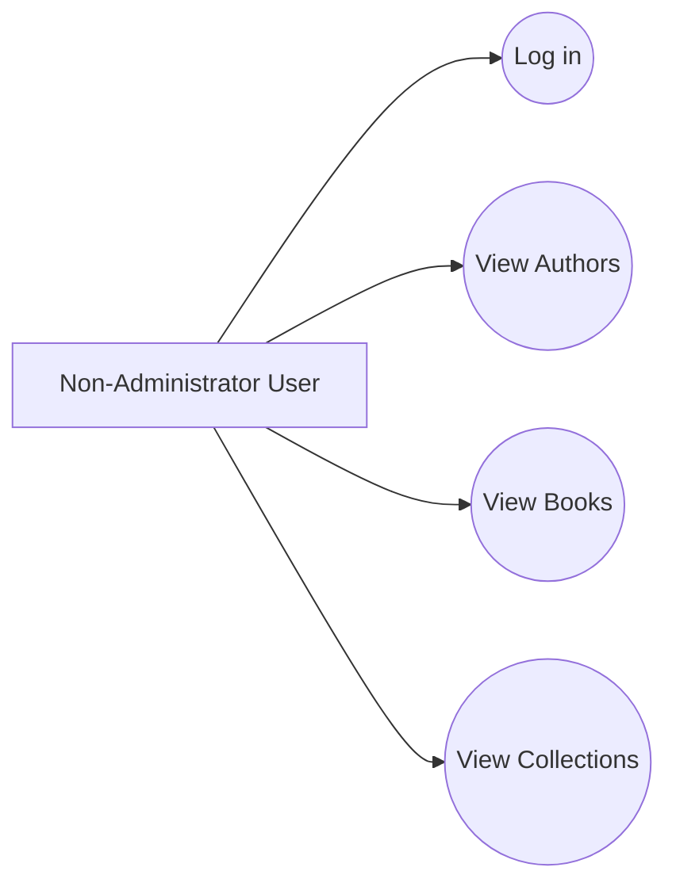
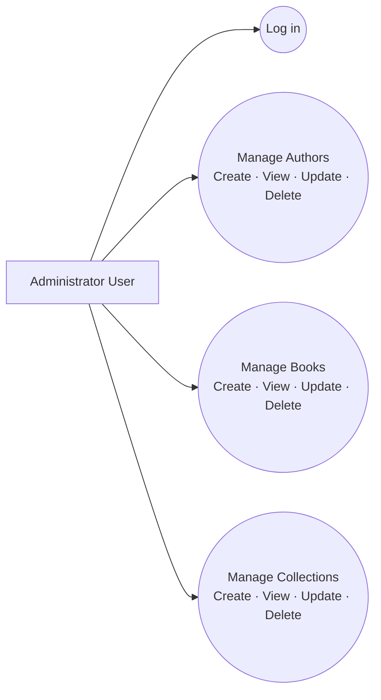

# Requirements Analysis: Main Use Case Diagrams

## Main Use Case Diagrams

### Use Case Diagram: Non-Administrator User

The following diagram shows that the actor (a standard non-administrator user) can log in and perform read-only operations on the three entities: Author, Book, and Collection.

> **Original report asset:** The original use case diagram should be preserved at `../assets/04-requirements-analysis/use-case-non-admin-original.png`.

### Use Case Diagram: Administrator User

The following diagram provides an overview showing that the actor (administrator) can log in and perform full CRUD operations on each of the entities: Author, Book, and Collection.

> **Original report asset:** The original use case diagram should be preserved at `../assets/04-requirements-analysis/use-case-admin-original.png`.
