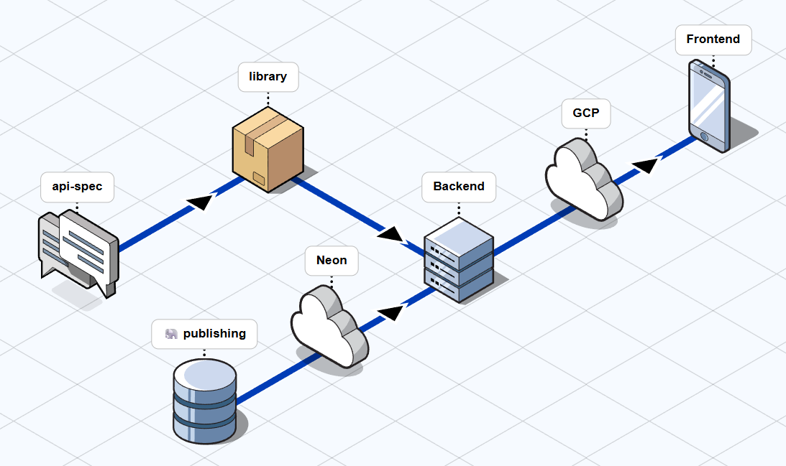

# Architecture

The project architecture has been designed following a modular and decoupled approach, with the goal of meeting client requirements while ensuring maintainability, scalability, and consistency across the different system components.

*Architectural solution diagram, created using FossFlow.*

The core of the architectural design is the public repository `book-publishing-api-spec`, which formally defines the RESTful API contract using the OpenAPI 3.1 standard. This repository describes all available endpoints, data models, requests, and responses, establishing a single, versioned contract that acts as the source of truth for the rest of the system.

Based on this specification, the OpenAPI Generator plugin is used to automatically generate an external Kotlin library, which is published via GitHub Packages. This library contains the controller interfaces and the Data Transfer Objects (DTOs) for requests and responses. This approach ensures that the backend implements exactly the defined contract, preventing inconsistencies, reducing errors, and guaranteeing that the API documentation is always up to date.

The public repository `book-publishing-backend`, developed using Kotlin, Spring Boot, and Gradle, consumes this generated library and uses it within its REST infrastructure layer, applying the Ports and Adapters Architecture (also known as Hexagonal Architecture).

Regarding data persistence, the backend uses Liquibase to define and version the schema of a relational PostgreSQL database. Database migrations are executed automatically using a Docker image configured through a `docker-compose.yml` file. The database deployment and update process is managed through a GitHub Action, enabling controlled and reproducible application of changes to a database hosted on NeonTech.

The backend packages the Java Archive (JAR) using a `Dockerfile`, which is deployed to Google Cloud Platform via a `cloudbuild.yaml` file on every commit to the `main` branch. This provides a scalable and reliable infrastructure for exposing the RESTful API.

Finally, the system is consumed by the public repository `book-publishing-app`, a frontend developed as a native Android application using Kotlin and Jetpack Compose. The app communicates with the backend through the REST API, clearly separating presentation logic from business logic and following best practices for modern mobile application development.

Overall, this architecture enables a clear separation of responsibilities, facilitates parallel development, and ensures a high level of consistency between the API contract, the backend, and the mobile client.
