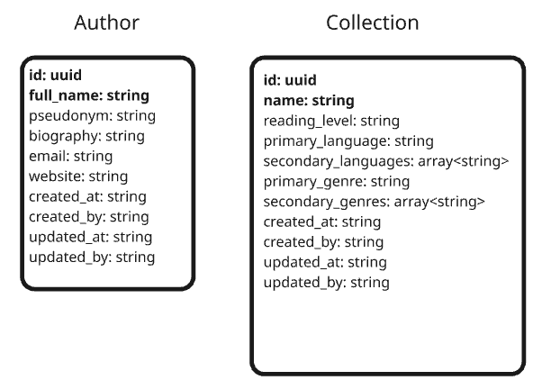
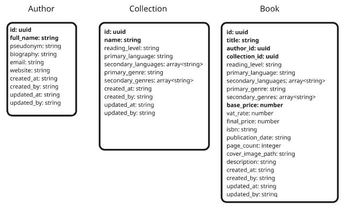

# API Contract

Once the planning and milestones have been defined, along with the requirements, use cases, business rules, and an architectural proposal for the system, we can proceed to define the REST API contract.

Starting with this step is essential in order to apply the API-First methodology adopted in this project. The contract is not part of either the server environment or the client environment, as it does not directly participate in the execution of the system; instead, it represents a formal agreement between the client and the server.

The contract is contained in a repository named `book-publishing-api-spec`, hosted on GitHub. Gradle is used as the build automation and dependency management tool, and OpenAPI is used as the descriptor for the API format.

## Conceptual Design of OpenAPI Components

The first step is to analyse the schemas that will make up the API specification. Accordingly, the following structure has been defined for the Book, Author, and Collection objects, specifying not only the attribute names but also whether they are required (marked in bold) and their data types. These schemas represent the Data Transfer Objects (DTOs) that the REST API will send (responses) or receive (requests) through the different HTTP methods.

*Design of the OpenAPI schemas for Author and Collection (top image) and Book (right image), showing attributes and data types (required fields in bold).*
