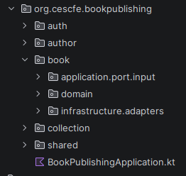

# Server Environment: RESTful API

Once the contract has been established, work can begin on the server environment, which consists of two main components: the backend in the form of a RESTful API, where requests are processed, business logic is executed, and interactions with the database take place; and the database itself, where the system information is stored.

## RESTful API

The backend is hosted in the [`book-publishing-backend`](https://github.com/CescFe/book-publishing-backend) repository. The chosen programming language is Kotlin, the framework is Spring Boot, and Gradle is used as the dependency and build management tool.

- **Kotlin:** a modern, statically typed language (variable types are known at compile time) that runs on the Java Virtual Machine (JVM). Fully interoperable with Java, it provides a more concise and safer alternative. It combines object-oriented and functional programming paradigms, reduces verbosity, and helps prevent Null Pointer Exceptions.
- **Spring Boot:** a Java framework that simplifies application development by automating configuration, promoting the Convention over Configuration principle, and providing dependency starter packages.
- **Gradle Build Tool:** the dependency management and build automation tool responsible for compilation, packaging, test execution, deployment, and artifact publishing.

## Main Dependencies

- **book-publishing-api-spec:** the API contract described in the specification repository.
- **Spring Data JPA:** the most widely used implementation of the Java Persistence API (JPA), facilitating access to and interaction with the database.
- **Spring Security:** the de facto standard for managing authentication and authorization.
- **JUnit 5:** the most popular unit testing framework in the Java ecosystem.
- **MockMvc:** a testing framework used to simulate HTTP operations.
- **Testcontainers:** a testing framework based on Docker images, used to verify interactions with the database.
- **PostgreSQL:** an object-relational database management system (ORDBMS) used as the project's database.
- **Liquibase:** a tool for managing and versioning database schemas.
- **Docker:** enables separation of the application from the infrastructure. It is used both to manage production deployment and to run a local image that simulates the real database environment.
- **Spotless:** a static analysis and code formatting tool that ensures consistent code style and adherence to best practices.
- **GitHub Actions:** used to manage continuous integration and continuous delivery (CI/CD) workflows.

## Methodologies Applied

### API-First

An approach to API development from a product-oriented perspective, aiming to produce modular and interoperable APIs. In this project, this methodology has clearly been applied by generating a real API contract in the `book-publishing-api-spec` repository, which is consumed by the backend.

### Hexagonal Architecture (Ports and Adapters)

Proposed by Alistair Cockburn in 2005, its goal is to create loosely coupled architectures by isolating business logic from external concerns (user interfaces, databases, APIs), thereby improving maintainability, adaptability, and testability.

In this project, the codebase is organised into the three classic layers of hexagonal architecture: domain, application, and infrastructure. Additionally, ports (interfaces that isolate layers and act as contracts) and adapters (implementations of those contracts) are applied.

### Domain-Driven Design

A methodology that prioritises understanding and modelling the specific problems of the domain in which the system operates. In software design, it captures and represents domain concepts.

In the backend, DDD principles are followed by starting the implementation from the Domain layer, defining Value Objects, their structure, and the associated business rules.

### Vertical Slice Architecture

An approach that organises code by features or use cases, grouping related components together. In this project, the vertical slice approach is applied on top of the hexagonal architecture by first dividing the codebase into contexts (`auth`, `author`, `book`, `collection`, and `shared`) and then into layers (`domain`, `application`, and `infrastructure`).

*Backend folder structure, applying Hexagonal Architecture and Vertical Slice.*

## Applied Design Patterns

Several design patterns have been applied throughout the codebase in order to prevent tight coupling, with the aim of producing software that is easier to understand, maintain, and test. The objective is that anyone reviewing the system's behaviour or introducing changes can understand the code with the lowest possible entry barrier and learning curve.

### SOLID Principles

#### Single Responsibility Principle (SRP)

A class or module should have only one reason to change, meaning it should have a single, well-defined responsibility. Some examples found in the codebase include:

- **Controller:** in the REST infrastructure layer, its sole responsibility is handling HTTP requests. It delegates the execution of the use case to the application layer.
- **Use case or interactor:** in the application layer, its only responsibility is to execute a specific business use case (such as “create a book”).
- **Repository:** in the persistence infrastructure layer, its only responsibility is data access.

#### Open/Closed Principle (OCP)

Classes, modules, or functions should be open for extension but closed for modification. Examples include:

- **PasswordEncoder:** its configuration is open for extension through the `PasswordConfig` class, while its usage inside the `UserService` class is closed to modification.
- **Repositories:** the interface defining `BookRepository` can be extended without modifying existing code, while the code that uses this repository (for example, the `GetBookInteractor` class) remains closed to modification.

#### Liskov Substitution Principle (LSP)

Subtypes must be substitutable for their base types without altering the correctness of the program.

- **Value Classes:** for example, `BookId` (a value object in the domain layer) is represented at runtime as a UUID. Therefore, it can be used wherever a UUID is expected, without losing compile-time type safety.

#### Interface Segregation Principle (ISP)

Clients should not be forced to depend on interfaces they do not use; it is preferable to split interfaces into smaller, more specific ones.

- **Use cases:** they are segregated, each with its own interface. For example, `GetBookUseCase` and `ListBookUseCase`.
- **Validations:** specific validations depend on their own interfaces. For instance, `BookDomainService` is responsible only for ISBN uniqueness validations.
- **Repository usage:** each client uses only what it needs. For example, the `BookRepository` interface exposes multiple methods, but `GetBookInteractor` only uses `findById()`, while `ListBooksInteractor` uses `findAllSummary()` and `countAll()`.

#### Dependency Inversion Principle (DIP)

High-level modules should not depend on low-level modules; both should depend on abstractions, and abstractions should not depend on details. This means prioritising abstraction over implementation.

- **Application layer:** the application layer is abstracted from infrastructure through the use of ports and adapters. The domain is accessed via the `BookRepository` interface, so the `GetBookInteractor` service (application layer) depends on a domain interface, not on an infrastructure implementation.
- **Infrastructure layer:** the `GetBookController` depends on the `GetBookUseCase` interface and is abstracted from the concrete `GetBookInteractor` implementation.

### Factory Pattern

A creational design pattern that provides an interface for creating objects while delegating the responsibility of deciding which concrete object to instantiate.

- **Object Mother:** applied in tests (for example, `AuthorObjectMother`) to reduce test verbosity and abstract object creation logic.
- **Exceptions Handling:** applied to the management of controlled exceptions, simplifying their creation (for example, `BookDomainException`).

### Convention over Configuration

Also known as Coding By Convention. The framework establishes default rules and conventions, reducing repetitive configuration and allowing developers to focus on the specific aspects of application logic.

- **Minimal configuration:** as much configuration as possible is delegated to the framework, avoiding custom configuration classes. Examples include using Jackson for JSON serialization or not defining manual beans for application-layer services.
- **Spring Data JPA:** query methods are delegated to JPA whenever possible, avoiding manual query implementations for methods such as `findById()` or `existsByIsbn()`.
- **Dependency Injection:** unnecessary or optional uses of `@Autowired` have been avoided, for example in `JpaBookRepository`.

### Other Applied Principles

Other very popular principles that have been actively applied are **KISS** (Keep It Simple, Stupid), **YAGNI** (You Ain't Gonna Need It), **DRY** (Don't Repeat Yourself), and **Least Astonishment**, by trying not to include unnecessary codification and complexities, maintaining a clear nomenclature in the methods, and reusing code through function extraction (in coherence with the Vertical Slice, within the same context or, when transversal, locating them in the `shared` context).

Other less popular principles that have been applied are:

- **DbC (Design By Contract):** using preconditional validations in the creation of domain Value Objects, for example `BookTitle` and the use of `init` and `require`.
- **Fail Fast:** immediate validations upon object construction (for example, `BookId`) or use case execution (for example, `GetBookInteractor`).
- **CQS (Command Query Separation):** differentiating use cases into queries or commands.
- The `readOnly` property has been applied to query transactions.

## Configured Environments

Through different application files, the following environments have been configured:

| Environment | Purpose |
| --- | --- |
| **local** | Intended for local development and debugging. It does not raise the database, as this is raised separately with Docker Compose, creating a PostgreSQL container that emulates the production one. |
| **test** | Intended for persistence integration tests. It executes Liquibase, raising a database image. |
| **development** | A temporary environment that is born and dies in GitHub CI/CD. |
| **production** | Connected to the real database. |
