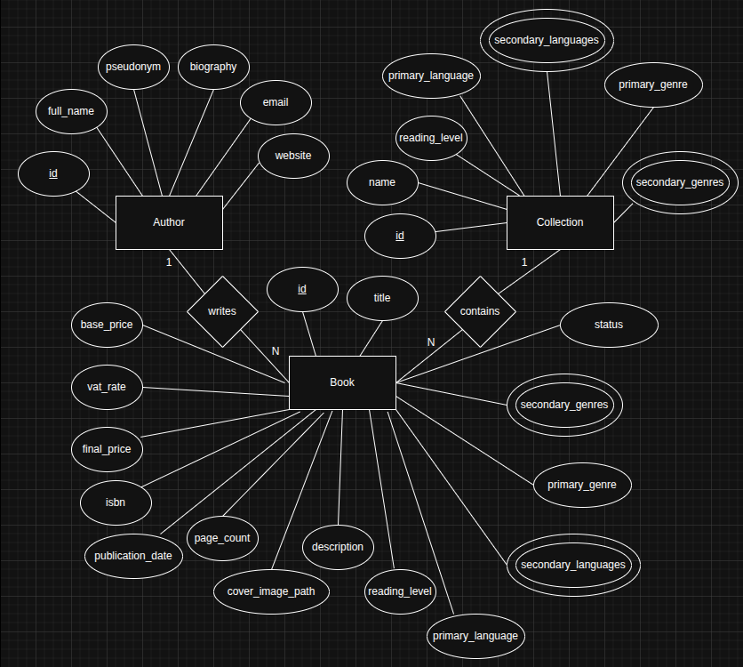
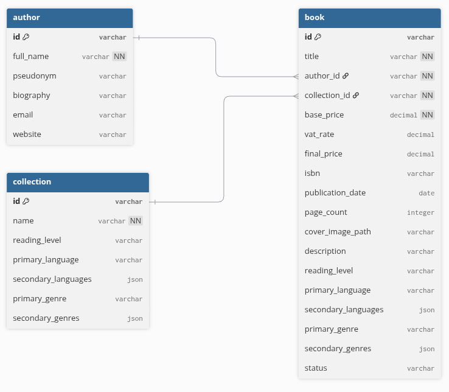

# Server Environment: Database Design

## Database

A database is a digital collection of structured and organized information that can be easily accessed, managed, and updated. It is generally controlled by a Database Management System or DBMS, which is software that acts as an interface to efficiently and securely manage said information.

The first thing we needed to know before implementing our database was whether we needed a relational database (SQL) or a non-relational database (NoSQL). As a general rule, SQL databases are suitable for structured and consistent data, and systems with complex relationships that require integrity; while NoSQL is suitable for unstructured and changing data, systems with massive scalability, flexibility, and speed. There are solutions that combine the best of both, implementing the Command Query Responsibility Segregation (CQRS) pattern, reserving write operations to persist data in an SQL DB and delegating read operations to snapshots stored in a NoSQL DB.

Our case clearly fits the general case of relational databases. Next, with the ER diagram, we will model the domain, with the logical design, we will transform it into relational tables, and with the physical design, we will implement it in a DBMS.

## Conceptual Design of Entity Relationship

The first step in designing the database structure was to design an Entity-Relationship Diagram, where the entities Book, Author, and Collection have been visually represented with rectangles, the relationships between entities and their cardinality have been defined with diamonds, and the attributes of each entity have been assigned with ellipses. Multivalue attributes have been represented with double ellipses.

### Entities and Attributes

- **Book:** `id` (PK), `title`, `base_price`, `vat_percentage`, `final_price`, `isbn`, `publication_date`, `number_of_pages`, `cover_image_path`, `description`, `reading_level`, `main_language`, `other_languages`, `main_genre`, `secondary_genres`.
- **Author:** `id` (PK), `full_name`, `pseudonym`, `biography`, `email`, `website`.
- **Collection:** `id` (PK), `name`, `reading_level`, `main_language`, `other_languages`, `main_genre`, `secondary_genres`.

### Relationships and Cardinalities

- **1 Author writes N Books:** an author can write many books; a book only belongs to one author.
- **1 Collection contains N Books:** a collection can contain many books; a book only belongs to one collection.

Taking into account the definition of the client's requirements, the use cases, the business rules, and the API contract that has already been designed, the simplest possible schema has been defined, which nonetheless fulfills all the technical and functional requirements that must be achieved in this project.

*Project Entity-Relationship Diagram.*

## Relational Logical Design

The next step is to perform a relational logical design that defines the data structure without depending on a specific DBMS. The following DBML code has been written, which is easily convertible into a graphic representation. Fields that are primary or foreign key, non-nullable fields, and types have been indicated. The code and graph are attached below.

*Tables of the relational logical design.*
