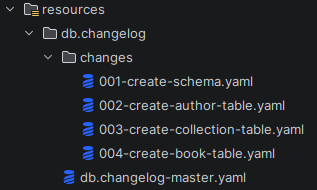
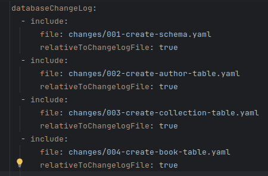
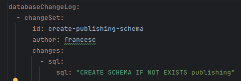
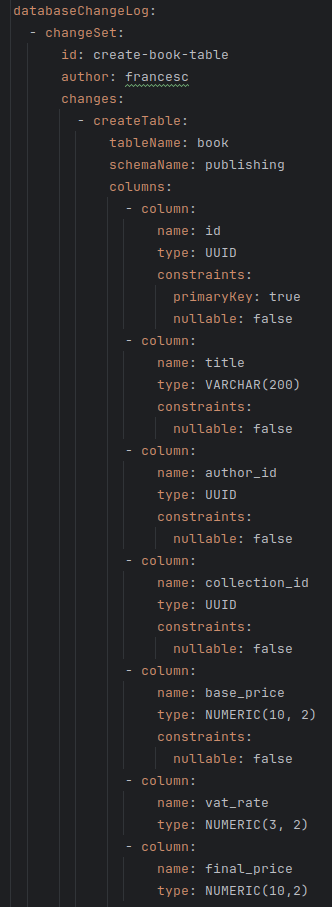
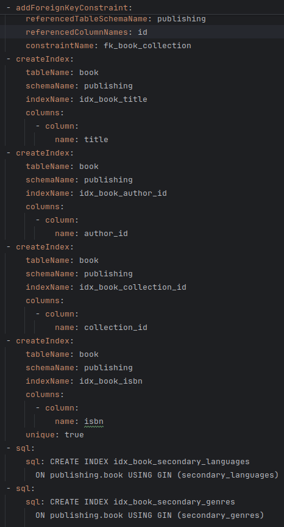
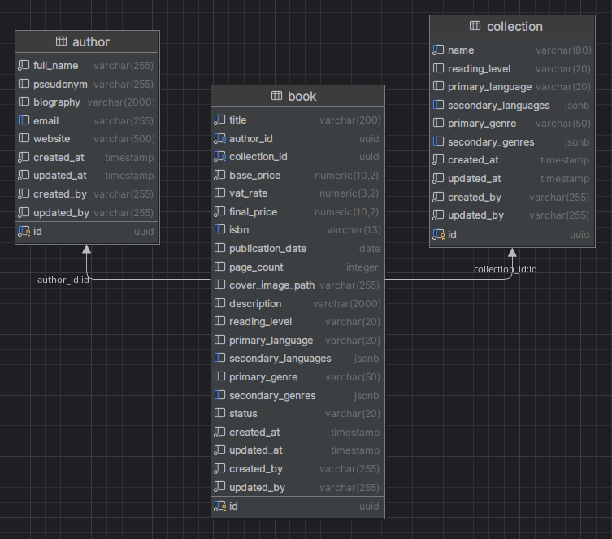

# Server Environment: Database Physical Design

## Physical Design with Liquibase

The physical design adapts the logical model to a specific DBMS, defining data types, constraints, and indexes. We have chosen PostgreSQL as the DB manager, which is technically an ORDBMS, as it is a widely used option in the industry (58% use among professionals according to the Stack Overflow survey in 2025) and for its native UUID and JSONB types, which we will use as the types for primary keys and multivalue attributes.

Liquibase has been chosen to manage and version the database and its changes from the backend repository. This facilitates database control, application testing—especially its persistence layer—and centralizes the server environment infrastructure.

The Liquibase files can be found in the backend repository, within the resources path. An attempt has been made to atomize the schema creation to make it more readable and maintainable. The schema is not managed with SQL files, thus applying the Dependency Inversion Principle, prioritizing abstraction over implementation: we do not know which DBMS is implemented—we configure this to be managed from `docker-compose`—but we use the native Liquibase syntax, which manages the implementation transparently for us.

*Liquibase files in the backend.*

During the physical implementation, the following improvements have been added:

- **Addition of uniqueness constraints:** thanks to the contract, we know which fields are unique.
- **Addition of indexes:** to improve some queries, indexes have been added to unique fields and JSONB fields.
- **Addition of audit fields:** the standards `created_by`, `created_at`, `updated_by`, and `updated_at` have been added.

Some code screenshots are attached:

*Liquibase migration history.*

*Schema creation.*

*Start of the Book table creation file with the declaration of the first of its attributes, the type and some constraints.*

*End of the same file, where the indexes are defined.*

## Description of Tables and Fields

### Author Table

This is the table where the information of the Author entity lives. Its fields are:

- **`id` (PK):** it is the author's UUID. It is the table's primary key.
- **`full_name`:** it is the author's name and surname(s). It is a required field.
- **`pseudonym`:** it is the author's pseudonym.
- **`biography`:** author's biography.
- **`email`:** author's email. It is a unique field.
- **`website`:** author's website.

### Collection Table

This is the table where the information of the Collection entity lives. Its fields are:

- **`id` (PK):** it is the collection's UUID. It is the table's primary key.
- **`name`:** it is the name of the collection. It is a required and unique field.
- **`reading_level`:** it is the reading level of the collection's target reader.
- **`main_language`:** main language in the collection's books.
- **`other_languages`:** other languages present in the collection.
- **`main_genre`:** main genre transversal to the collection.
- **`secondary_genres`:** secondary genres or subgenres of the collection.

### Book Table

This is the table where the information of the Book entity lives. Its fields are:

- **`id` (PK):** it is the book's UUID. It is the table's primary key.
- **`title`:** it is the title of the book. It is a required field.
- **`author_id`:** it is the UUID of the book's author. It is the foreign key that references the related element of the Author table.
- **`collection_id`:** it is the UUID of the collection the book belongs to. It is the foreign key that references the related element of the Collection table.
- **`base_price`:** it is the price of the book before taxes. It is a required field.
- **`vat_percentage`:** it is the VAT percentage.
- **`final_price`:** it is the book's base price plus taxes, i.e., the Public Sale Price.
- **`isbn`:** it is the International Standard Book Number, a 13-digit code that identifies the book's edition. It is a unique field.
- **`publication_date`:** it is the publication date of the book's edition.
- **`number_of_pages`:** it is the total number of pages of the book's edition.
- **`cover_image_path`:** it is the internal reference to the location of the book cover image resource.
- **`description`:** book synopsis.
- **`reading_level`:** it is the reading level of the book's target reader.
- **`main_language`:** main language in which the book is written.
- **`other_languages`:** other languages contained in the book.
- **`main_genre`:** main genre of the book.
- **`secondary_genres`:** secondary genres or subgenres of the book.

## PostgreSQL Diagram

Finally, this is the PostgreSQL schema of our database.

*PostgreSQL database schema.*
