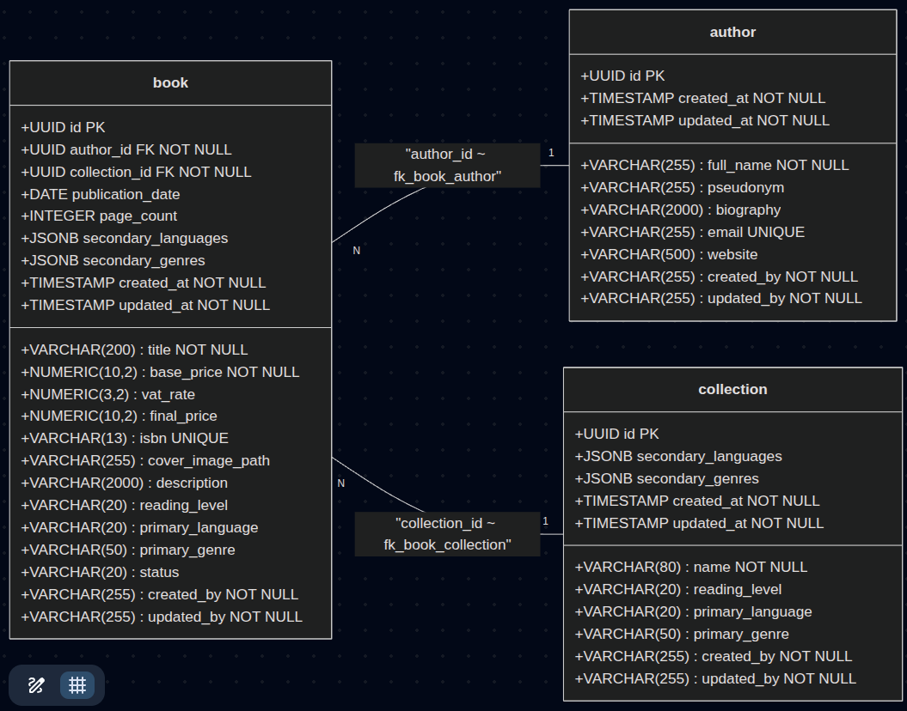
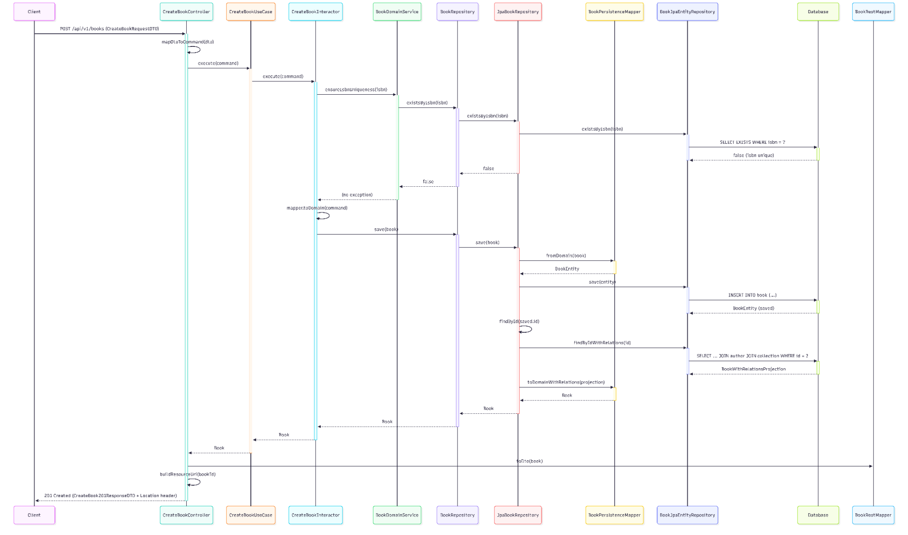
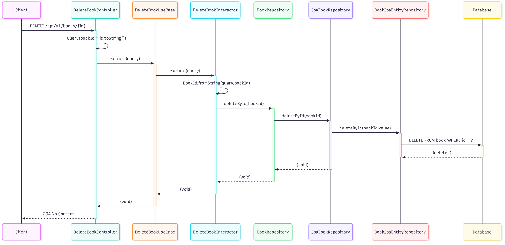
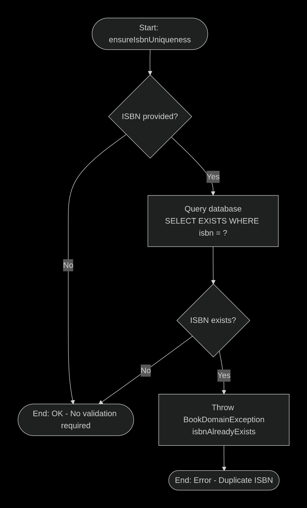
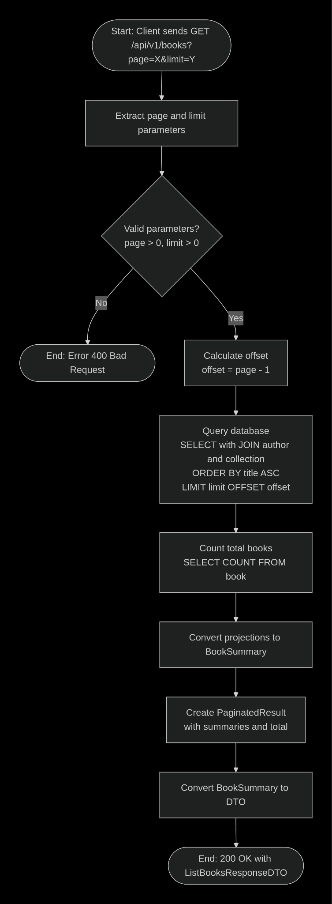

# Server Environment: Object-Oriented Design

## Object-Oriented

The following section describes how the tables and relationships have been transferred to classes, objects, and execution flows.

### Class Diagrams

The class diagram represents the transition from the relational model to the object-oriented model, defining the domain classes, their attributes, and the relationships between them.

*Project Class Diagram.*

## Sequence Diagram

Sequence diagrams describe the temporal interaction between the different objects of the system for the execution of the defined use cases. Hereunder, we attached the sequence diagrams for the Use Case of Creating and Deleting a Book.

*Sequence diagram for the use case of creating a Book.*

*Sequence diagram for the use case of deleting a Book.*

## Activity Diagram

Activity diagrams allow us to model the execution flow of the system processes, including decisions and validations. The activity diagram for the use case of validating a book's ISBN uniqueness and the book listing diagram are attached.

*Activity diagram for validating a Book's ISBN uniqueness.*

*Activity diagram for the Book listing flow.*
