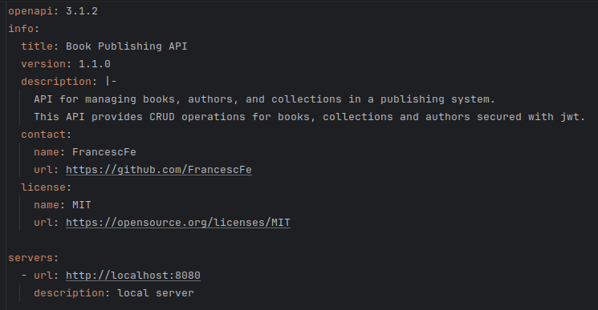
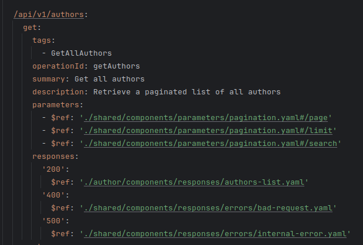
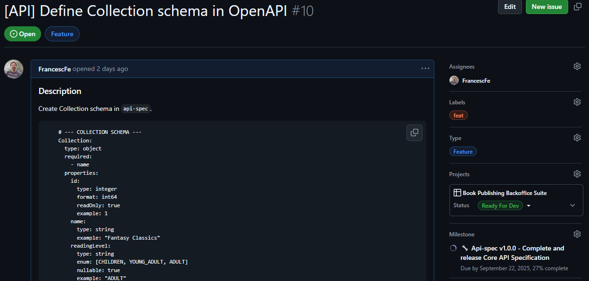
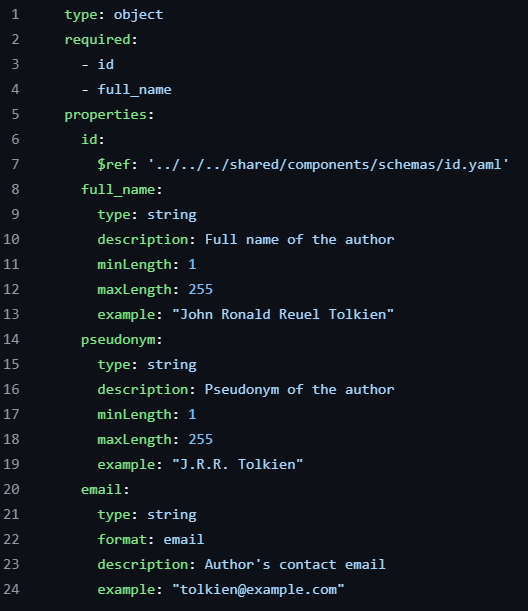

# API Contract Implementation: OpenAPI Specification

## OpenAPI Endpoint Modelling

The first step is to have the models designed (as already done in previous chapters). The next step, in order to be able to use them, is to add actual content to the repository.

*API specification header.*

Next, we can start defining the CRUD operations that make up the REST API. A style has been applied that aims to keep the main file (usually named `openapi.yaml`) as lightweight as possible, extracting shared components and schemas into separate files. This approach avoids code duplication and improves the maintainability and readability of the specification.

*GET Authors operation retrieving the list of authors.*

## OpenAPI Components Modelling

Throughout this process, we follow the previously defined Work Implementation Cycle. This implies creating a work item, performing functional refinement from a product perspective, and carrying out a technical refinement where, ideally, a proposed solution approach is included and documented in the GitHub issue description.

It is true that with this methodology a significant amount of time is invested before starting the “strict” implementation phase; however, this also reduces the time required for coding, helps avoid errors, and minimises the need for later refactoring.

*Example of a refined ticket.*

At this point, we can finally implement the object using OpenAPI syntax.

Afterwards, additional API schemas and the remaining endpoints are implemented.

*Example of the AuthorSummary structure.*
