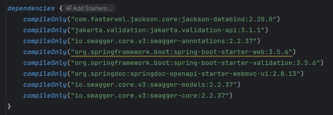
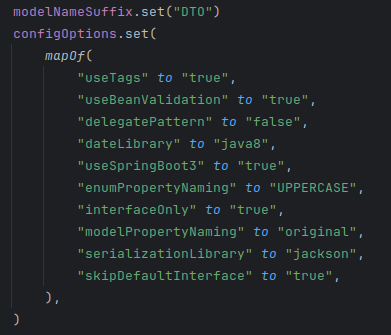

# API Contract Implementation: Code Generation and Publishing

## OpenAPI Generator Plugin Configuration

The most effective way to establish a real contract for our REST API that aligns with the API-First methodology being applied is through code generation. If the backend must use predefined classes, this guarantees that it complies with the contract and that the API documentation remains the single source of truth. Code generation also significantly reduces the likelihood of errors.

There are currently several tools available for this purpose, with OpenAPI Generator being the most widely adopted. This is the tool selected for this project (version 7.15). Integrating and configuring this plugin for the first time, without prior experience, is not particularly intuitive; the most effective approach was to consult the official documentation and review public GitHub repositories that already use it.

To configure the generator, it is necessary to specify the dependencies required by the generated code at compile time. These dependencies are declared as `compileOnly` because this project only generates code to be consumed by other projects and is not executed directly. The main dependencies include Jackson for JSON serialization, Jakarta Validation for data validation, Spring Boot for REST controllers, and Swagger/SpringDoc for API documentation.

*Dependencies required to use the OpenAPI Generator plugin.*

The generator configuration options allow fine-grained control over how the code is generated. For example, `interfaceOnly` generates only interfaces because the implementation is manually provided in the backend; `useBeanValidation` adds validation annotations to the models; and `modelNameSuffix` appends the “DTO” suffix to class names to follow project conventions. The `useSpringBoot3` option ensures compatibility with Spring Boot 3.

*Plugin Configuration.*

Once configured, the plugin provides two main Gradle tasks that can be executed from the command line: `openApiValidate` and `openApiGenerate`. The first task validates the OpenAPI specification to ensure it is correct and, when the `recommend` option is enabled, provides suggestions for improvement. The second task generates the Kotlin Spring code according to the specified configuration. In addition, the `build` task has been configured to depend on code generation, so every time the project is compiled, the generated code is automatically updated if there are changes in the specification.

## Publishing the External Library

A further improvement to the API contract consists of packaging the autogenerated classes and publishing them as an external library that will be consumed by the backend. This is the key step to guaranteeing a strict API-First implementation, treating the API as a product in its own right. This approach facilitates scalability, enforces a clear separation of responsibilities by fully decoupling the contract from the backend, and enables reuse across multiple projects while ensuring consistency. It also enforces version control, managing evolution, integration, and backward compatibility with previous versions.

The project has been configured to publish the external library as a Maven package hosted on GitHub Packages. To automate this process, a CI/CD GitHub Action has been created to publish the package. A Personal Access Token (PAT) was generated and stored as a GitHub Secret variable.
