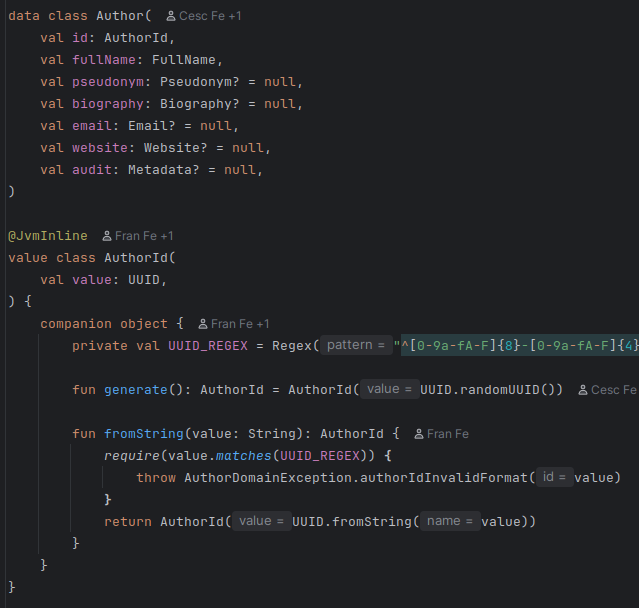
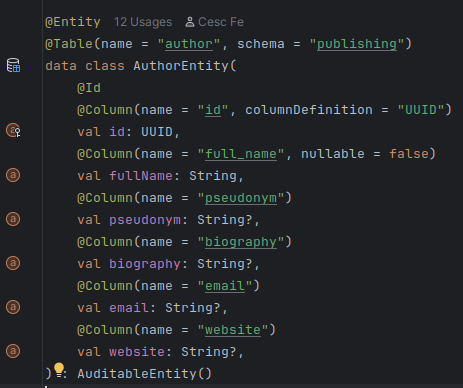
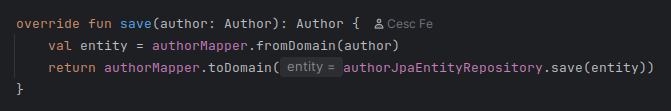
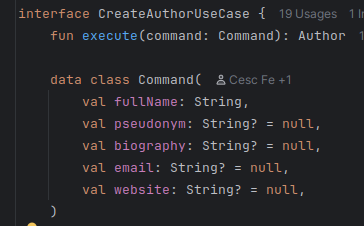
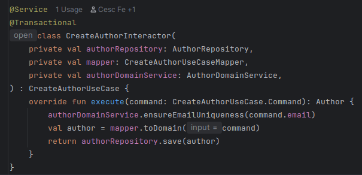
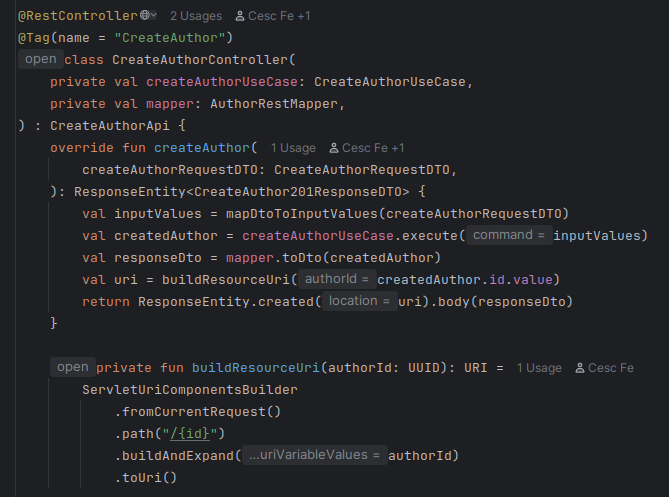

# Backend Implementation: Use Case Implementation

## Implementation of a Use Case in the Backend

Now we will discuss the process followed to implement a use case in the backend, using the creation of an author as an example. We start from the assumption that the endpoint has already been defined in the contract and the corresponding classes have been generated thanks to OpenAPI Generator. The first step is modeling the domain layer.

## Domain Layer Modeling

In the domain layer, we apply DDD, and we assist ourselves by defining Value Objects and establishing business rules. The Author Value Object is defined as a data class, and each of its attributes are also Value Objects defined as value classes. We apply business rules and contract validations at the moment of constructing each of them.

In the domain, we must also declare the interface of the repository methods we need.

## Persistence Modeling in the Infrastructure Layer

In the infrastructure layer, we need to model the author entity that will help us persist information in the database using JPA. Metadata management has been delegated to JPA's `AuditingEntityListener`.

We must also define the methods we need in `AuthorJpaEntityRepository`, as well as implement it in `JpaAuthorRepository`. Next, the persistence mapper must be implemented, which allows us to convert a domain object into a persistence object and vice versa.

## Service Modeling in the Application Layer

The application layer orchestrates the use case. First, we define the use case interface, then the mapper that allows us to convert the input value into a domain object or vice versa.

Now we can implement the service:

## Controller Modeling in the Infrastructure Layer

Finally, we can implement the interface generated by OpenAPI Generator. The controller flow is: mapping the request DTO to Input Value (command in this case), executing the use case, mapping the response to response DTO, creating the URI resource that will be sent as a header in the response, and returning the response in the form of `ResponseEntity`.

