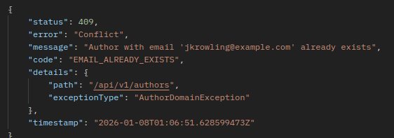

# Backend Implementation: Error Handling

## Error Handling

The application implements a centralized exception management system that guarantees consistent responses and facilitates maintenance. A `GlobalExceptionHandler` has been implemented that intercepts and processes all exceptions, and domain exceptions are encapsulated in business rules.

## GlobalExceptionHandler

The `GlobalExceptionHandler` is a class that centralizes exception management throughout the application. Spring automatically intercepts exceptions thrown from any REST controller. Different types of exceptions are processed:

- Domain: grouped in `BookDomainException`, `AuthorDomainException`, and `CollectionDomainException`.
- Validation: `MethodArgumentNotValidException`, `ConstraintViolationException`.
- Infrastructure: `HttpMessageNotReadableException`, `NoHandlerFoundException`, `MethodArgumentTypeMismatchException`.
- Security: `BadCredentialsException`.
- Generic: `Exception`.

## Standardized Response Model

All error responses use the same model defined in `ApiError`, which provides a consistent structure.

