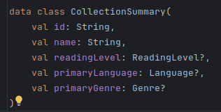
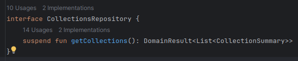
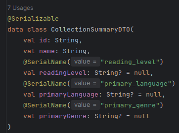
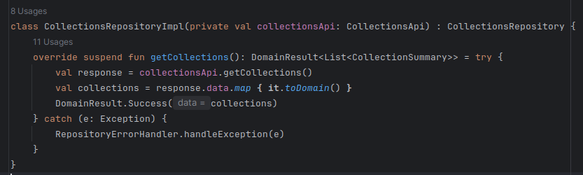
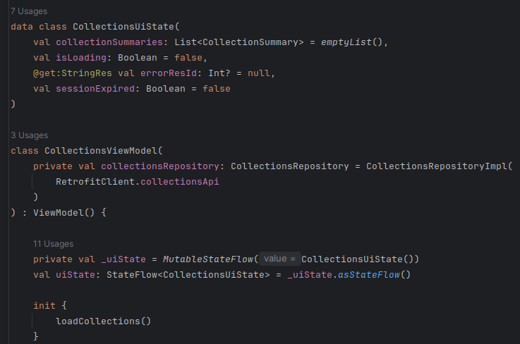
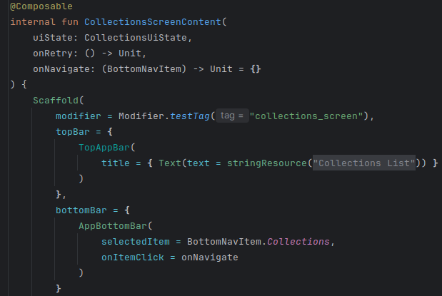

# Frontend Implementation: User Story Implementation

## Implementation of a User Story in the Frontend

To implement a user story in the APP, for example, viewing the list of collections, we will follow these steps.

## Domain Layer Implementation

In this layer, domain objects are modeled, ensuring that the same validations applied in the backend are propagated, and the ports used by the data layer are implemented.

*Domain model and port of the collection list.*

## Data Layer Implementation

In this layer, data is obtained from the backend, modeled as DTOs, mapping methods are created, the API response is defined, and the repository adapter is implemented.

*DTO and repository implementation.*

## ViewModel Implementation in the UI Layer

The ViewModel manages the UI state (loading, error, success) and coordinates with the repository.

## Screen Implementation in the UI Layer

First, we define the card for each collection list item in the `CollectionSummaryCard` class. Then, in `CollectionsScreen`, we define the Composable that shows the UI and observes and reacts to the state defined from the ViewModel.

To allow the user to reach this screen, the `AppNavigation` class must be updated with the new navigation flow.
