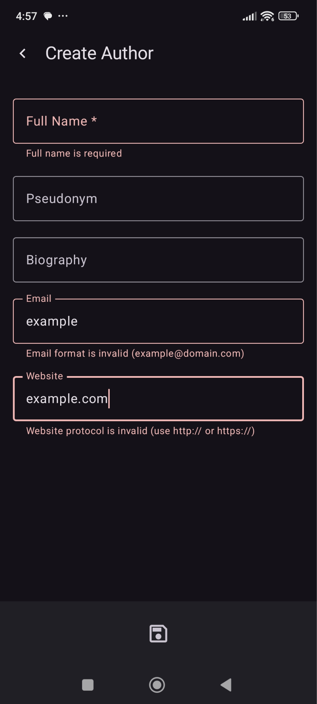
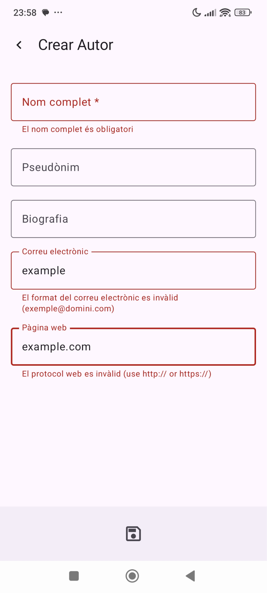

# Frontend Implementation: UX and Compatibility

## Preventing Errors with Warnings

The application implements a real-time validation system that shows warnings to the user as they type. This is possible through the `updateField()` function, which runs every time a field changes. Warning messages are displayed using Material Design 3's `OutlinedTextField`, thus ensuring adherence to Google's recommendations for native Android development best practices.

In editing or creation forms, the same validations as in the backend have been implemented to minimize errors.

## Ensuring Functionality on Most Used Mobile Devices

An attempt has been made to guarantee functionality on the most used mobile devices in the following ways:

- **Compatible SDK configuration:** `build.gradle.kts` is configured with at least Android SDK 7.0 (Nougat), which is from 2016.
- **Responsive layouts in Jetpack Compose:** adaptive modifiers like `fillMaxWidth()`, `fillMaxSize()`, and `weight(1f)` have been used.
- **Support for long forms:** `verticalScroll()` is used with small screens in mind.
- **Convention over Configuration:** adaptive components are delegated to Material Design 3.
- **Previews:** use of previews to validate in different configurations.
