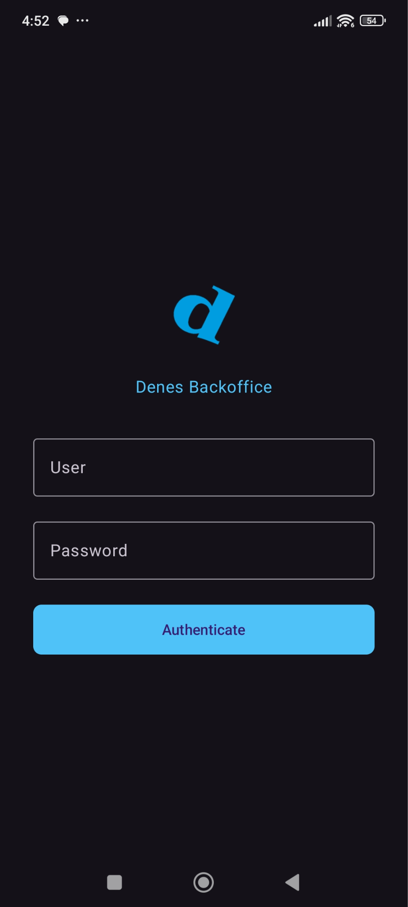
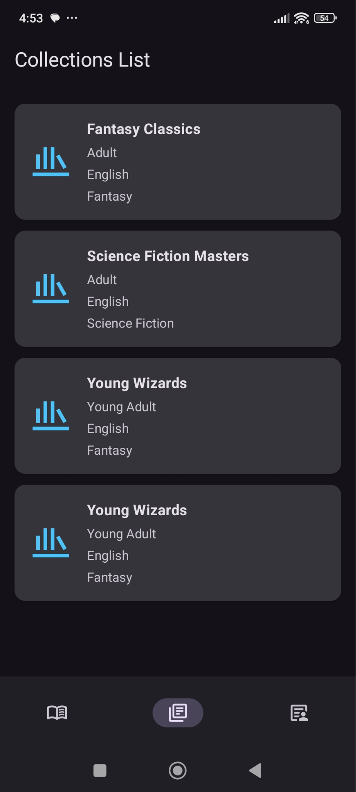
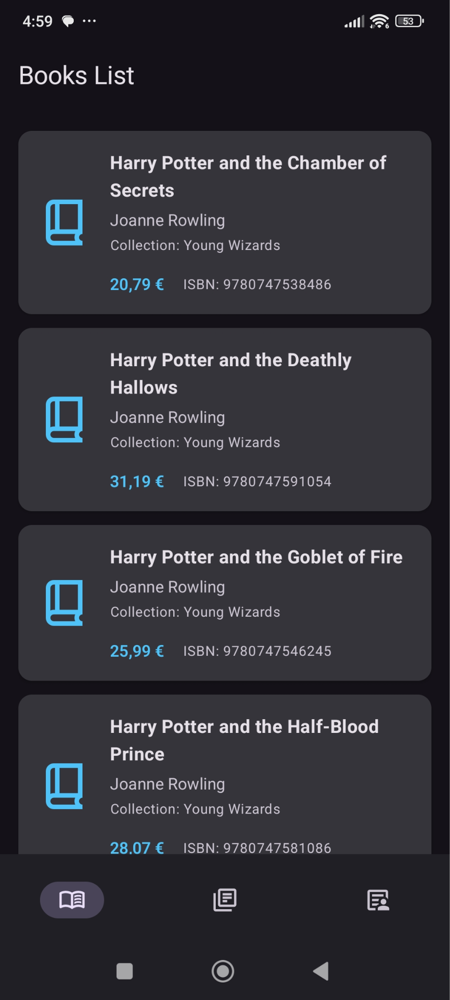
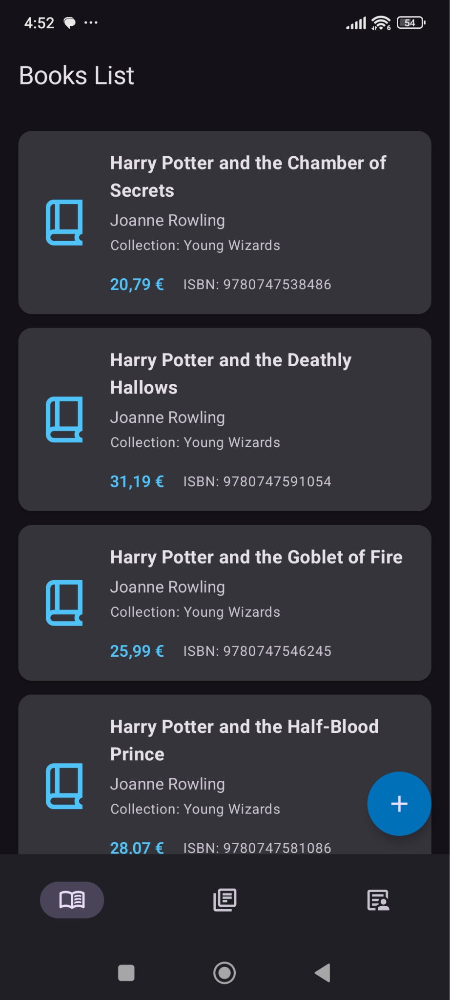
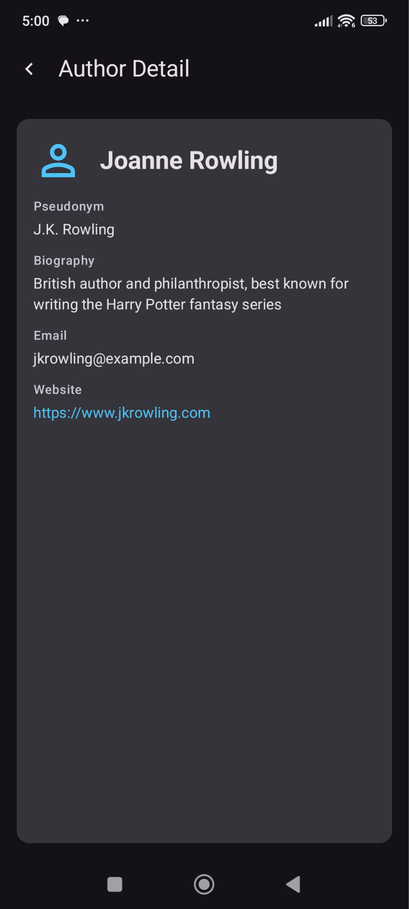
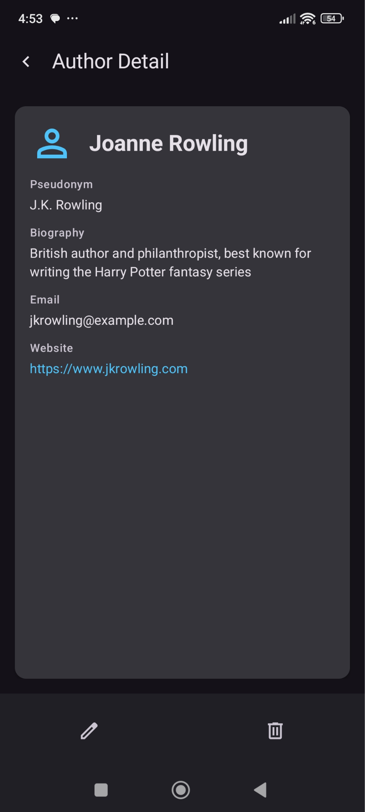
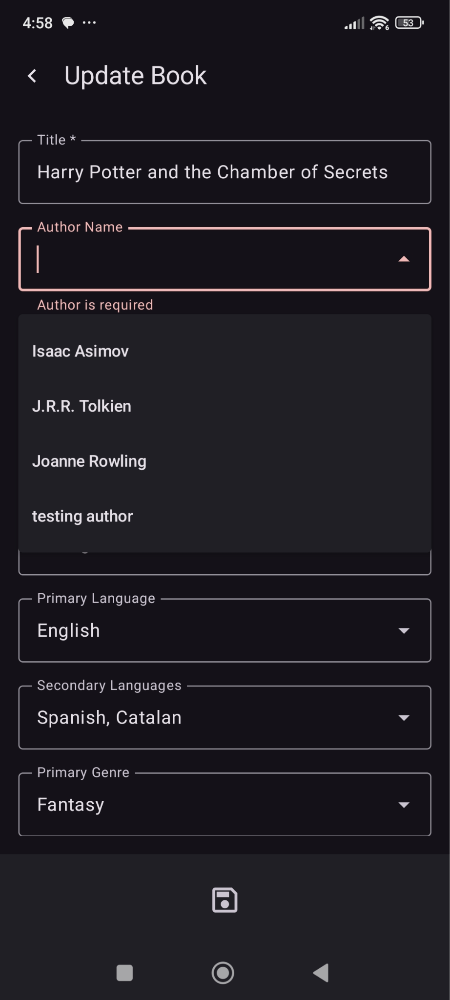
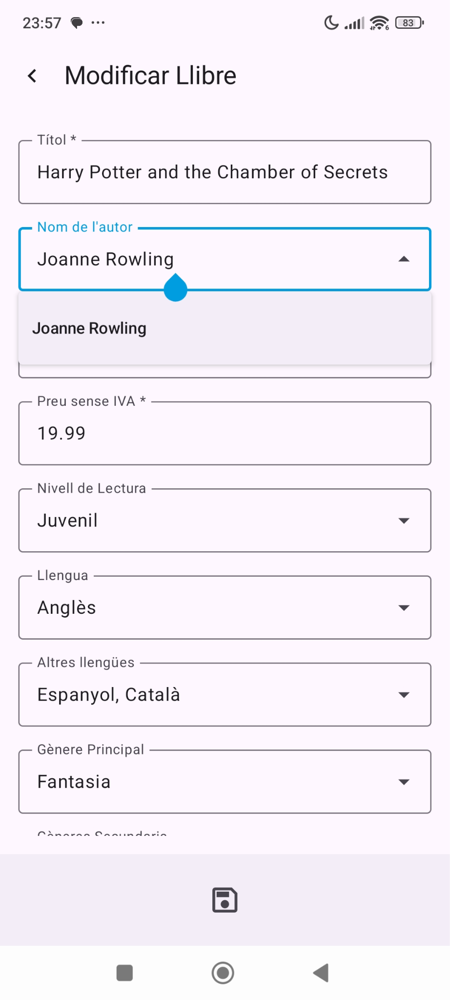

# Frontend Implementation: MVP Images

## MVP Images

*On the left, the authentication screen. On the right, the collection list screen.*

## Book List (Admin Session vs. Base User Session)

*Comparison of the administrator session against the session of a base user from the book list screen. The difference is that the Floating Action Button at the bottom right, which allows navigating to the author creation view, is only present in the administrator session.*

## Author Detail (Admin Session vs. Base User Session)

*Comparison of the administrator session against the session of a base user from the author detail screen. The difference is that the Bottom Navigation Bar, which allows editing or deleting an author, is only present in the administrator session.*

## Book Update (English Dark Mode vs. Valencian Light Mode)

*Comparison of an administrator session against a base user session from the author detail screen. The difference is that the Bottom Navigation Bar allowing to edit or delete an author is only present in the administrator session.*
