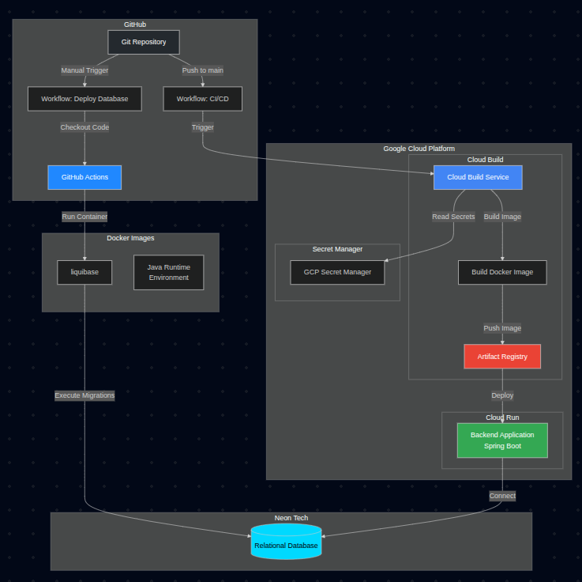
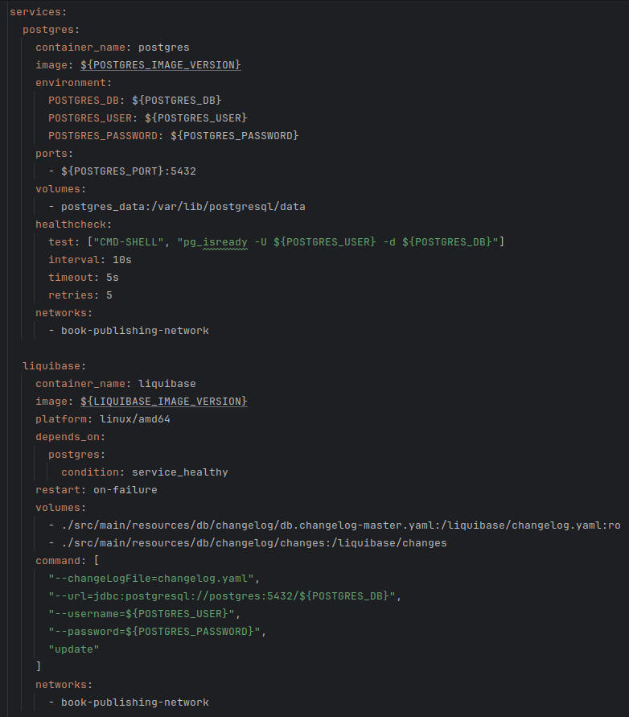
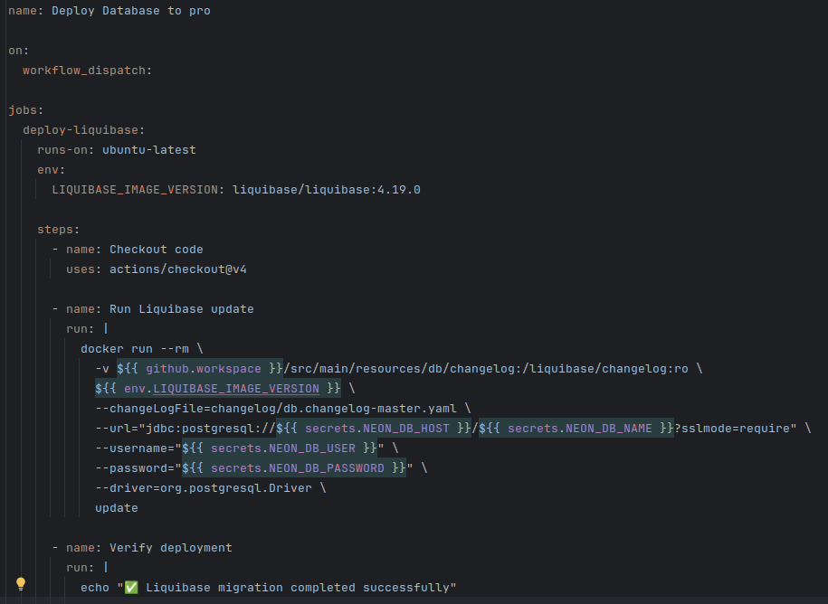

# Deployment

## Deployment Diagram



*Deployment diagram of the server environment.*

## Server Deployment Description

The system uses an automated deployment with Docker and Google Cloud Platform, divided into two main processes.

### Database Deployment

A `docker-compose` has been configured to execute the Liquibase migration in a controlled manner. This is useful not only for database deployment but also for virtualization in testing and local development environments.



*Configured docker-compose.*

The production environment database lives on NeonTech cloud servers, because it offers a free plan that suited our needs. It offers 0.5GB storage capacity (more than enough for our use). A GitHub Action has been configured to automate the Liquibase migration; this allows not depending on entering the Neon UI to make schema changes: everything is controlled from the backend and GitHub.



*GitHub Action to execute Liquibase migration.*

### Backend Deployment

The backend deployment is completely automated:

1. **Trigger:** When a push is made to the `main` branch, Google Cloud Build is automatically activated.
2. **Image Build:** Cloud Build executes the `cloudbuild.yaml` file, which:
   - Reads secrets from Google Secret Manager (`GITHUB_USERNAME` and `TOKEN_PAT`).
   - Builds the Docker image using the multi-stage Dockerfile.
   - Tags the image with the Artifact Registry repository name.
3. **Publication:** The Docker image is published to Google Artifact Registry.
4. **Deployment:** The image is automatically deployed to Google Cloud Run.
5. **Configuration:** The application starts with the `pro` profile that uses the environment variables configured in Cloud Run.

#### Prerequisites

For deployment, the following must be configured:

- **Google Cloud Platform:**
  - Project created with billing enabled.
  - Cloud Build API enabled.
  - Artifact Registry API enabled.
  - Cloud Run API enabled.
  - Secret Manager configured with GitHub credentials.
- **GitHub:**
  - Secrets configured for the database.
  - Secrets configured for authentication.
- **Neon Database:**
  - PostgreSQL database created.
  - Access credentials available.

To carry out a successful deployment, it is necessary to configure several environment variables responsible for:

- Consuming the external library of the API specification contract.
- Authentication and authorization with JWT.
- Database connection.
- Dockerizing the environment.

### Server Description

Throughout the app development, a server hosted on the Render cloud was used, but due to it being intended more for proofs of concept and having a policy of putting the server to sleep after 15 minutes of inactivity (needing about 3 minutes to wake up again), it was decided to migrate to Google Cloud Platform.

The Render server will remain as a staging or development environment but is currently deactivated, until we configure a `dev` or `stg` database.

#### Google Cloud Platform

The application is deployed to Google Cloud Platform using the following services:

- **Google Cloud Run**
  - Service: Cloud Run (serverless container platform)
  - Region: `europe-west1`
  - Features:
    - Container execution without server management
    - Automatic scaling according to load
    - Included in free plan
    - Billing per use (only execution time is paid)
    - Automatic HTTP/2 and HTTPS support
    - Integration with other GCP services
- **Google Artifact Registry**
  - Service: Artifact Registry
  - Region
  - Repository
  - Function: Storage of generated Docker images
  - URL
- **Google Cloud Build**
  - Service: Cloud Build (CI/CD)
  - Function: Automated build and deployment
  - Trigger: Push to GitHub repository `main` branch
  - Configuration: `cloudbuild.yaml`
- **Google Secret Manager**
  - Service: Secret Manager
  - Function: Secure credential storage
  - Stored secrets:
    - GitHub user for private package access
    - GitHub Personal Access Token

#### Neon Database

- Service: Neon (PostgreSQL Serverless)
- Type: Managed PostgreSQL Database
- Features:
  - PostgreSQL 16
  - Mandatory SSL connections
  - Serverless plans with pay-per-use

#### GitHub Actions

- Service: GitHub Actions (CI/CD)
- Function: Execution of workflows for validation and deployment
- Main Workflows:
  - Pull Request Validation: Executes tests and code validations
  - Deploy Database: Manual deployment of database migrations
  - Integration Validation: Integration validation with E2E tests

#### Deployment Architecture

The deployment architecture follows a serverless model:

- **Development:** Code is developed locally and hosted on GitHub.
- **CI/CD:** GitHub Actions validates code and Cloud Build builds the image.
- **Storage:** Image is saved in Artifact Registry.
- **Execution:** Cloud Run executes the image with automatic scaling.
- **Database:** Application connects to Neon PostgreSQL via SSL.

This architecture offers:

- **High availability:** Automatic scaling and redundancy.
- **Security:** Centralized secret management and SSL connections.
- **Cost-efficiency:** Billing only for real use.
- **Maintainability:** Automated deployment without manual intervention.

### Testing the Server

The recommended way to test the server is using Postman.

1. Copy the [Postman collection `book-publishing-api-collection.json`](https://github.com/CescFe/book-publishing-backend/blob/main/postman/book-publishing-api-collection.json) (folder: `./postman` in backend).
2. Point to the base URL.
3. To authenticate as administrator use the admin credentials.
4. To authenticate as base user use the base user credentials.
5. The token has a duration of 15 minutes.

Example of successful authentication cURL:

```bash
postman request POST '{{my_base_url}}/api/v1/auth/login' \
  --header 'Content-Type: application/json' \
  --body '{
    "username": "my_username",
    "password": "my_password"
  }'
```
